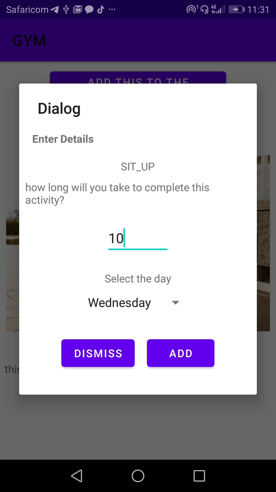
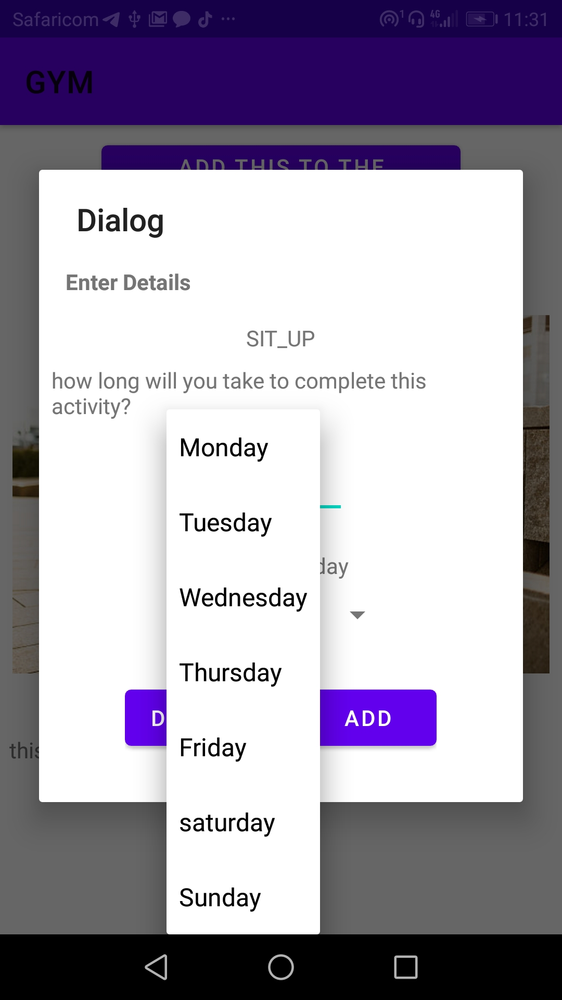

# Gym-game

This is a java app that takes your nornal routine of going to the gym but instead of going to the actual gym, 
since to the ongoing pendemic,This app loosen the queue in which it act as the insturctor at home in hand and avail every-event that one what to partake.

Phase 1
The first part of the app selecting  all the gym activity by choosing the all gym activity.

phase 2
After selecting all, you will see all the gym practice, one will choose the one prefered to his/her occasion disered.

phase 3
after each selection you will take the time and day to do the practice.

# ScreenShoT
          

